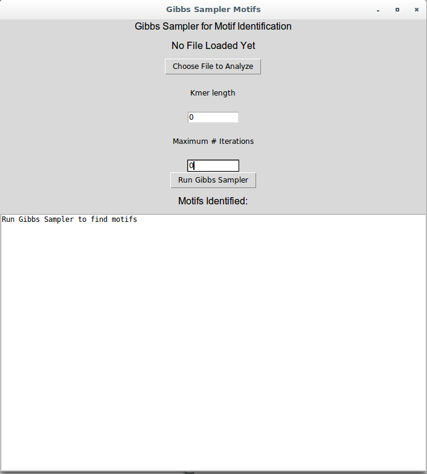
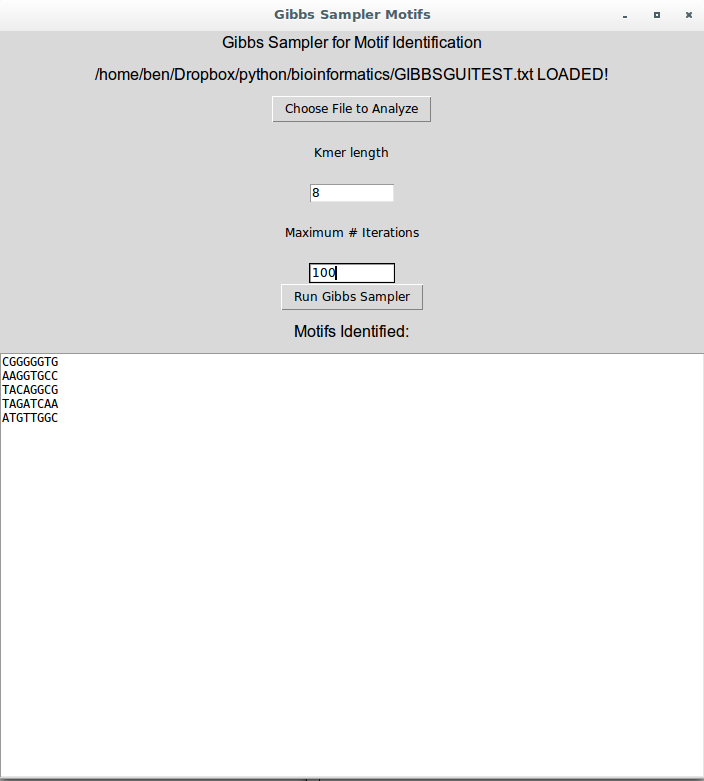

###########################################################
#Gibbs Sampler GUI for Bioinformatics Motif Identification#
############################################################
Author: Benjamin Suutari

This is a graphical user interface for motif identification

Dependencies: numpy and Tkinter

Input should be in a text file with each sequence separated by a newline \n

You can specify the length of motifs to identify

